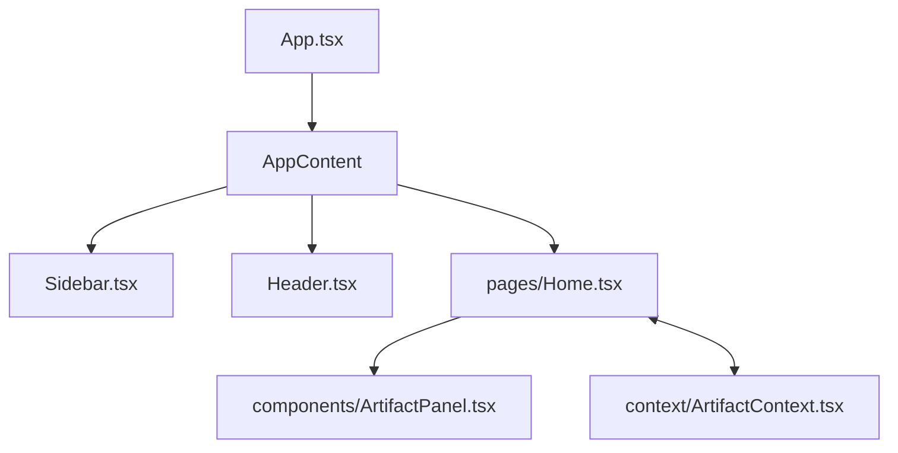

# 🧬 Frontend UI - /Intellidocs AI - frontend

The frontend is a **Single Page Application (SPA)** built with **React**, **Vite**, and **TailwindCSS**, following a component-driven architecture with atomic design principles.

---

## 🏙️ Component Architecture

## 📂 Folder-Item Roadmap

| Directory | Structure | Detail |
|-----------|-----------|--------|
| `src/context/` | State Management | Auth, Errors, Artifacts, Mobile. |
| `src/components/` | Reusable Units | Sidebar, Header, Markdown, Artifacts. |
| `src/pages/` | Routed Views | Home, Documents, Login, Signup. |
| `src/services/` | Networking | API, File, Chat services (Axios). |

### 📁 Key Files

*   `App.tsx`: Parent router and Responsive state management.
*   `pages/Home.tsx`: The heart of the app—3-Pane Workspace split-screen.
*   `components/ArtifactPanel.tsx`: High-fidelity interactive UI for LLM outputs.
*   `components/MarkdownRenderer.tsx`: Stream-parsing for auto-trigger components.

---

## 🎨 Theme Guidelines

*   **Font**: Inter / Roboto (Sans-serif).
*   **Colors**: Pure Black, Clean White, Emerald Green (`#10A37F`).
*   **Aesthetics**: Glassmorphism, Monochromatic, Stealth Dark.
*   **Animations**: Framer Motion (Spring-based).
